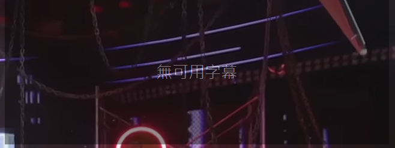
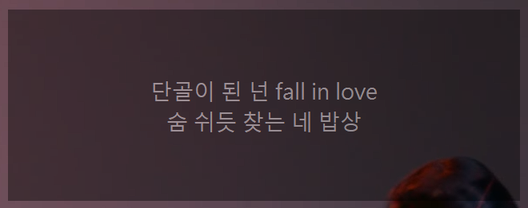
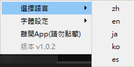
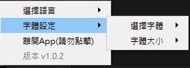

# youtube字幕程式 v1.0.2
## 安裝使用步驟
1. 下載v1.0.2版本，並且解壓縮。
2. 安裝網頁插件:瀏覽器擴充功能->開發者模式打開->選取載入解壓縮資料夾->選擇edge-youtube-monitor資料夾
3. 執行app.exe。
4. 可從下面系統盤右鍵選擇語言，並且調整字體/文字大小。
5. 關閉請將程式直接關閉。
## 程式功能
#### 無字幕時

#### 有字幕時

#### 右下角系統操作選單(選擇語言)

#### 右下角系統操作選單(選擇字體/大小)

## Bug
1. 系統盤退出功能暫時不可用

## 待改善
1. 將自動翻譯加入
2. 新增背景顏色調整
3. 視窗可根據文字調整大小
4. 無可用字幕自動縮小視窗
